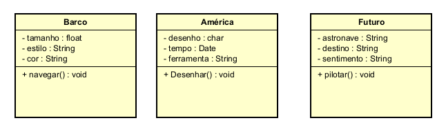
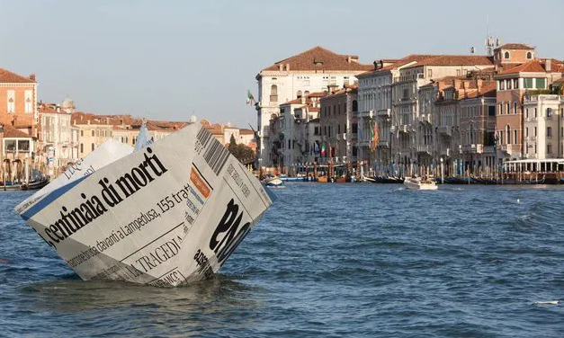
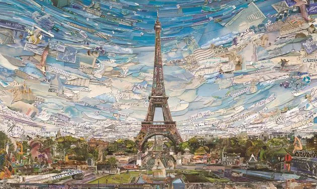
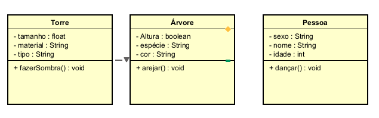
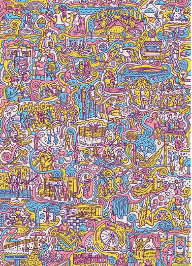
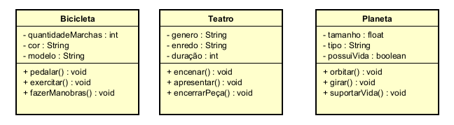
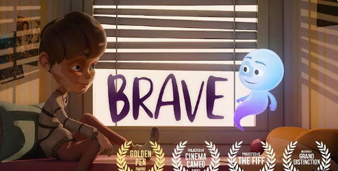
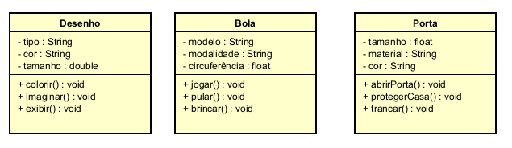

# LP1
Pasta criada para salvar projetos da aula de Linguagem de Programação 1. 

__________________________________________________________________________
Média Alunos - Teste de Mesa
O teste de mesa realizado com 10 alunos
[Media 10 Alunos](<E1_Classes_métodos_atributos_e_objetos - parte 1/Media_10_Alunos.xlsx>)

🎵 Música - Aquarela - Toquinho

Diagrama UML

🖼️ Vik Muniz – Lampedusa

(https://cdn.culturagenial.com/imagens/lampedusa-cke.jpg?class=article)

Diagrama UML

🖼️ Vik Muniz – Torre Eiffel

(https://cdn.culturagenial.com/imagens/paris-0-cke.jpg?class=article)

Diagrama UML

🎨 Doodle

(https://static.wixstatic.com/media/c097a7_2cbe4d15bd6149889672c78f175482dc~mv2.jpg/v1/fill/w_955,h_665,al_c,q_85,enc_avif,quality_auto/c097a7_2cbe4d15bd6149889672c78f175482dc~mv2.jpg)

Diagrama UML

🎬 Vídeo - Brave | Animated Short Film

(https://www.youtube.com/watch?v=iD_tsK_aqIQ)

Diagrama UML

